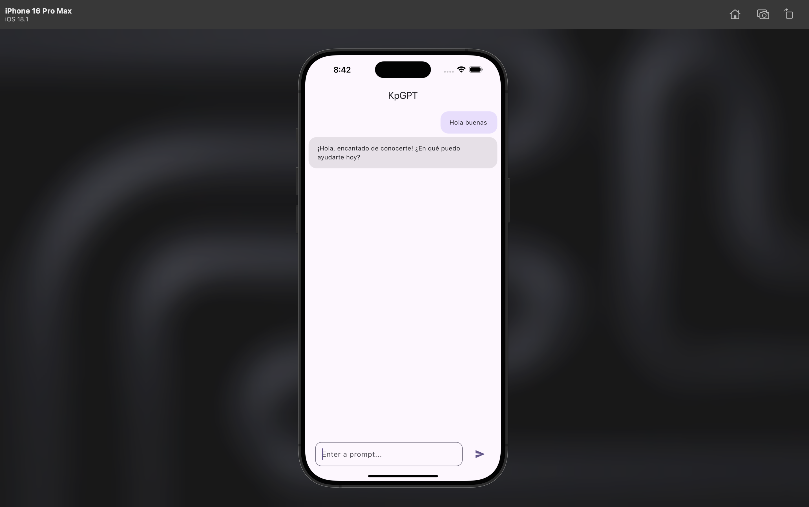

# kp_GPT_app

A new Flutter project.

## Correr en dev

1. Clonar el repositorio.
2. Crear una copia del ```.env.template``` y renombrarlo a ```.env``` y cambiar las variables de entorno.


## 📱 Vista Previa



